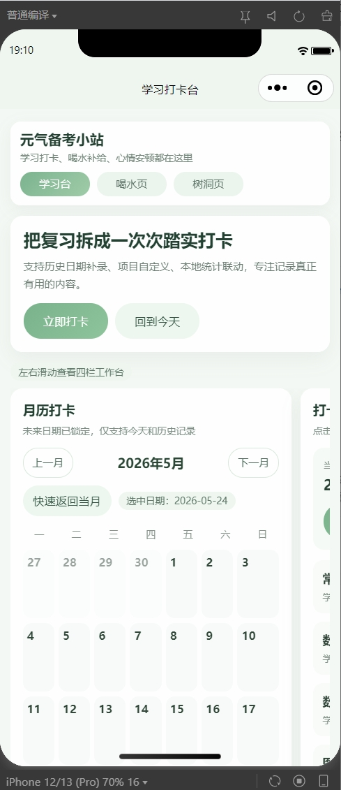
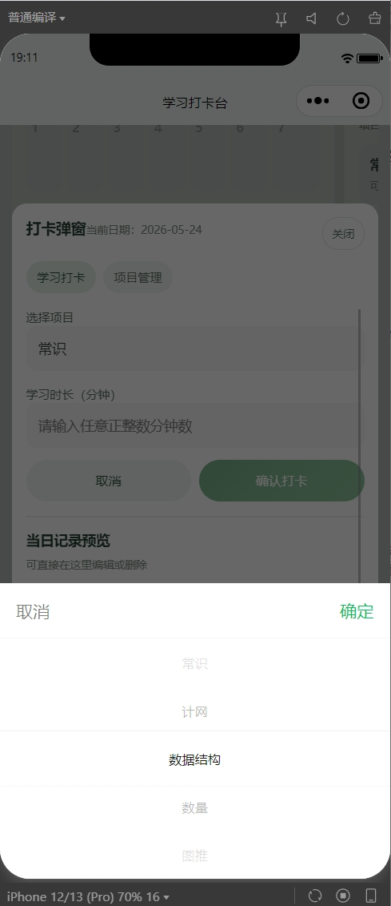
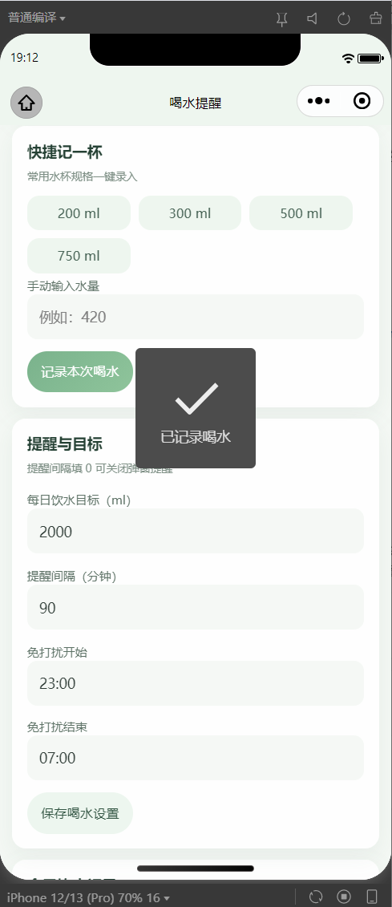
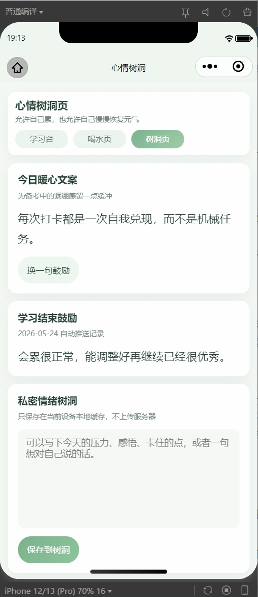
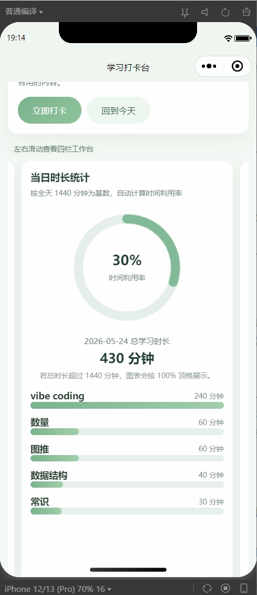

# 元气备考小站

> A WeChat Mini Program focused on study check-ins, hydration reminders, and emotional support for exam preparation.

`元气备考小站` 是一个基于微信原生小程序技术栈实现的备考陪伴型工具，面向考研、考公等高压备考场景，围绕学习记录、喝水提醒和情绪疏导三个高频需求进行设计。项目采用纯前端方案实现，不依赖后端服务，不接入第三方插件，适合作为小程序方向的课程项目、个人作品集项目或求职展示项目。

## 项目定位

- 面向备考人群的轻量化效率工具，而不是泛娱乐型打卡产品。
- 强调低干扰、易记录、可复盘，帮助用户形成更稳定的学习节奏。
- 通过本地持久化和直观反馈机制，在无服务端支持的前提下完成完整体验闭环。

## 核心功能

- 学习打卡：支持月历查看、跨月切换、历史日期补录，未来日期不可打卡。
- 项目管理：支持新增、编辑、删除学习项目，适配多科目并行备考场景。
- 时长统计：展示当日学习总时长和时间利用率，帮助用户快速复盘。
- 区间统计：支持按起止日期统计各项目累计时长，便于阶段性总结。
- 喝水提醒：支持目标设置、快捷杯型记录、手动录入和免打扰时段控制。
- 心情树洞：提供励志文案和心情记录入口，缓解备考期间的压力感。

## 项目亮点

- 从真实备考场景出发拆解需求，聚焦“记录、提醒、反馈”这条最核心的使用链路。
- 采用微信小程序原生方案独立完成产品设计与前端落地，工程结构清晰，易于展示。
- 基于本地缓存组织学习记录、喝水记录、项目数据和激励文案，实现多页面联动。
- 通过日历回显、环形图、进度条和弹窗反馈提升可视化体验，增强使用完成感。
- 在没有后端和推送能力的限制下，尽可能把提醒、统计和状态陪伴做完整。

## 产品思考与方案取舍

### 1. 为什么聚焦“学习打卡 + 喝水提醒 + 情绪记录”

备考类工具很容易不断叠加功能，但真正高频、低门槛、可持续使用的核心需求并不多。本项目优先选择了三个最贴近备考日常的场景：

- 学习打卡：满足“记录投入”和“形成节奏”的需求。
- 喝水提醒：覆盖长时间学习过程中的基础健康管理。
- 情绪记录：回应备考压力、焦虑和自我激励需求。

这三个功能分别对应效率管理、状态管理和情绪支持，能够形成一个足够轻量、但又相互补充的陪伴型产品闭环。

### 2. 为什么不做社交、排行、复杂激励体系

对于备考场景，过强的社交比较和娱乐化机制未必能提升长期使用体验，反而可能带来额外压力。因此本项目有意识地放弃了排行榜、社区互动、复杂勋章等设计，转而强调：

- 低干扰：打开即可记录，不增加额外操作成本。
- 可复盘：通过月历、统计和进度展示帮助用户感知积累。
- 轻陪伴：用提醒和励志文案提供温和反馈，而不是强刺激运营机制。

这个取舍更符合个人备考阶段对稳定节奏和心理负担控制的实际需求。

### 3. 为什么采用纯前端 + 本地持久化方案

项目以作品集展示和原型验证为目标，因此没有优先引入后端服务，而是采用微信小程序本地缓存完成数据持久化。这样做的好处是：

- 降低开发与部署复杂度，更适合快速验证产品思路。
- 保证 Demo 可独立运行，便于展示页面流程与核心交互。
- 将有限精力集中在需求拆解、信息结构和反馈机制设计上。

相应地，这也带来了明显边界：数据无法跨设备同步，提醒能力也受限于小程序前台运行状态。这些限制是当前阶段为了“低成本验证产品价值”而做出的主动取舍。

### 4. 如何在能力受限条件下保留产品价值

在没有后端、没有系统级推送能力的前提下，项目依然尽量保留了对用户有感知的关键价值：

- 用本地记录保证学习、喝水和情绪数据可持续积累。
- 用统计和可视化反馈提升用户对“坚持”和“投入”的感知。
- 用免打扰时段、快捷录入和轻弹窗提醒降低打扰感。

这部分设计体现的不是“功能做得最多”，而是“在实现约束下优先保留最重要的体验价值”。

## 界面预览

<p align="center">
  
  
  
</p>

<p align="center">
  
  
</p>

更多截图说明可查看 [screenshots/README.md](./screenshots/README.md)。

## 技术栈

- `WXML`
- `WXSS`
- `JavaScript`
- `JSON`
- `wx.setStorageSync / wx.getStorageSync`

## 项目结构

```text
.
├─app.js
├─app.json
├─app.wxss
├─data
│  └─messages.js
├─pages
│  ├─index
│  ├─mood
│  └─water
├─screenshots
├─utils
│  ├─date.js
│  └─storage.js
├─project.config.json
└─sitemap.json
```

## 本地运行

1. 使用微信开发者工具导入项目根目录。
2. 填写自己的小程序 `AppID`，或先使用测试号调试。
3. 点击“编译”即可在开发者工具中运行。

## 数据与使用说明

- 所有数据默认保存在当前设备的小程序本地缓存中，关闭后不会立即丢失。
- 喝水提醒属于小程序前台运行时的本地弹窗提醒，不等同于系统级通知推送。
- 本项目当前为前端本地 Demo，适合展示交互设计、页面实现和本地数据管理能力。

## 作品集描述

独立完成微信原生小程序“元气备考小站”的产品设计与开发，围绕备考用户的学习打卡、饮水提醒与情绪支持需求，完成需求拆解、交互设计、前端实现、本地数据持久化与统计联动，形成可运行的产品 Demo。
